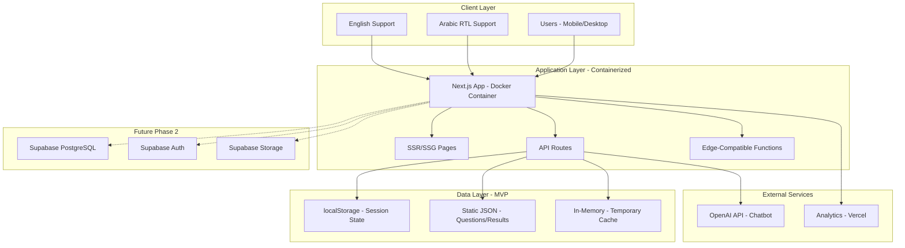
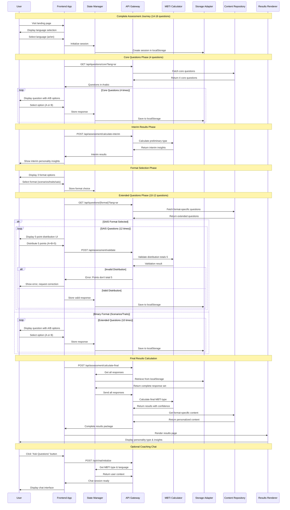
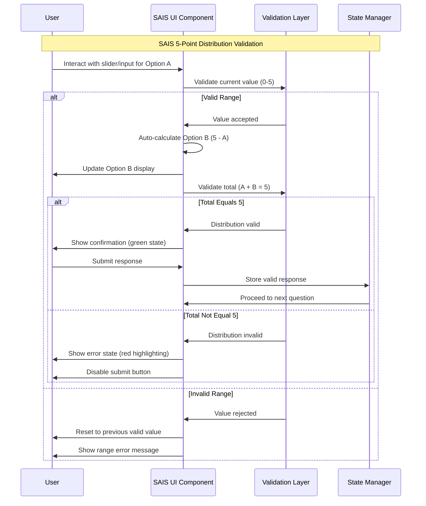

# MBTI Coaching Platform - Full-Stack Architecture

## 1. Introduction

This document outlines the complete fullstack architecture for MBTI Coaching Platform MVP, including backend systems, frontend implementation, and their integration. It serves as the single source of truth for AI-driven development, ensuring consistency across the entire technology stack.

This unified approach combines what would traditionally be separate backend and frontend architecture documents, streamlining the development process for modern fullstack applications where these concerns are increasingly intertwined.

### Starter Template or Existing Project

Based on the PRD and front-end specification, this is a **greenfield project** with specific technology recommendations:
- **Framework:** Next.js 14.2+ with App Router (specified in PRD)
- **Deployment:** Portable containerized architecture supporting Vercel, AWS, GCP, and self-hosted
- **Database:** MVP without database (localStorage), Phase 2 with Supabase PostgreSQL
- **Internationalization:** Bilingual support (English/Arabic) with RTL layouts

## 2. High Level Architecture

### Technical Summary

The MBTI Coaching Platform MVP utilizes a **portable Next.js full-stack architecture** with containerization support, enabling deployment flexibility across Vercel, traditional cloud providers, or self-hosted environments. The system operates without a database in MVP phase, using localStorage for session persistence and static JSON files for content delivery.

**Key Architectural Decisions:**
- **Portable Design:** Docker containerization for platform independence
- **MVP Data Strategy:** localStorage + static files (no database dependency)  
- **Phased Approach:** Ready for Supabase integration in Phase 2
- **Edge-First:** Optimized for edge computing and global performance
- **Bilingual Core:** Native Arabic/English support with RTL layouts

### System Architecture Diagram



## 3. Tech Stack

This is the **DEFINITIVE technology selection** for the entire project. All development must use these exact versions.

### Technology Stack Table

| Category | Technology | Version | Purpose | Rationale |
|----------|------------|---------|---------|-----------|
| **Frontend Language** | TypeScript | 5.3+ | Type-safe development | Prevents runtime errors, essential for complex MBTI logic |
| **Frontend Framework** | Next.js | 14.2+ | Full-stack React framework | SSR/SSG capabilities, App Router, built-in i18n |
| **UI Component Library** | Headless UI + Radix | 1.7+ / 2.0+ | Unstyled accessible components | Flexibility for custom SAIS 5-point UI, RTL support |
| **State Management** | Zustand | 4.4+ | Lightweight state management | Simple API, TypeScript native, perfect for assessment flows |
| **Styling Framework** | Tailwind CSS | 3.3+ | Utility-first styling | Rapid development, RTL support, consistent design system |
| **Form Management** | React Hook Form | 7.48+ | Form validation and state | Complex SAIS 5-point validation, performance optimized |
| **Internationalization** | next-i18next | 15.2+ | Bilingual support | Native Next.js integration, RTL support, type-safe |
| **API Type** | REST | Native | Backend communication | Simple, predictable, edge-compatible |
| **Runtime Environment** | Node.js | 18+ | Server execution | Stable LTS, Vercel optimized, container compatible |
| **Package Manager** | npm | 10+ | Dependency management | Built-in, reliable, widespread adoption |
| **Containerization** | Docker | 24+ | Portable deployment | Multi-platform deployment capability |

### Verified Compatible Package.json

```json
{
  "dependencies": {
    "next": "14.2.32",
    "react": "18.2.0",
    "react-dom": "18.2.0",
    "typescript": "5.3.3",
    "@headlessui/react": "^1.7.17",
    "@radix-ui/react-select": "^2.0.0",
    "@radix-ui/react-slider": "^1.1.2",
    "@radix-ui/react-progress": "^1.0.3",
    "tailwindcss": "^3.3.6",
    "clsx": "^2.0.0",
    "@heroicons/react": "^2.2.0",
    "zustand": "^4.4.7",
    "react-hook-form": "^7.48.2",
    "next-i18next": "^15.2.0",
    "openai": "^4.20.1"
  },
  "devDependencies": {
    "@types/react": "^18.2.37",
    "@types/node": "^20.9.0",
    "eslint": "^8.53.0",
    "eslint-config-next": "14.2.32",
    "autoprefixer": "^10.4.16",
    "postcss": "^8.4.31"
  }
}
```

## 4. Data Models

Based on the PRD requirements and assessment flows, I've identified the core data models that will be shared between frontend and backend. These models are designed to work with both MVP localStorage approach and future Supabase PostgreSQL integration.

### Assessment Session Model

**Purpose:** Tracks user's complete assessment journey including progress, responses, and results across all three formats (Life Scenarios, A/B Traits, SAIS Methodology).

```typescript
interface AssessmentSession {
  sessionId: string;
  language: 'en' | 'ar';
  currentStep: AssessmentStep;
  startTime: Date;
  completionTime?: Date;
  selectedFormat?: 'scenarios' | 'traits' | 'sais';
  coreResponses: QuestionResponse[];
  extendedResponses: QuestionResponse[];
  calculatedType?: string;
  confidence?: number;
  progress: number;
  isComplete: boolean;
}

type AssessmentStep = 
  | 'landing'
  | 'core-questions' 
  | 'interim-results'
  | 'format-selection'
  | 'extended-questions'
  | 'final-results'
  | 'coaching-chat';
```

### Question Response Model with SAIS Validation

**Purpose:** Stores individual question responses with format-specific validation, especially ensuring SAIS 5-point distribution constraints.

```typescript
interface QuestionResponse {
  responseId: string;
  sessionId: string;
  questionId: number;
  questionType: 'core' | 'extended';
  responseType: 'binary' | 'distribution';
  
  // Binary responses (Core + Scenarios + Traits)
  selectedOption?: 'A' | 'B';
  
  // SAIS distribution responses (must total exactly 5)
  distributionA?: number; // 0-5
  distributionB?: number; // 0-5
  
  // Metadata
  responseTime: Date;
  timeSpent: number; // milliseconds
  mbtiDimension: 'E-I' | 'S-N' | 'T-F' | 'J-P';
}

// SAIS Validation Function
function validateSAISDistribution(pointA: number, pointB: number): boolean {
  return (
    pointA >= 0 && pointA <= 5 &&
    pointB >= 0 && pointB <= 5 &&
    pointA + pointB === 5 &&
    Number.isInteger(pointA) &&
    Number.isInteger(pointB)
  );
}

// Valid SAIS combinations: (5,0), (4,1), (3,2), (2,3), (1,4), (0,5)
const VALID_SAIS_COMBINATIONS = [
  [5, 0], [4, 1], [3, 2], [2, 3], [1, 4], [0, 5]
];
```

### MBTI Results Model

**Purpose:** Represents calculated personality assessment results with format-specific content variations.

```typescript
interface MBTIResults {
  sessionId: string;
  calculatedType: string; // e.g., 'ENFP'
  confidence: number; // 0.0 - 1.0
  assessmentFormat: 'scenarios' | 'traits' | 'sais';
  language: 'en' | 'ar';
  
  // Dimension scores
  dimensions: {
    'E-I': { score: number; preference: 'E' | 'I' };
    'S-N': { score: number; preference: 'S' | 'N' };
    'T-F': { score: number; preference: 'T' | 'F' };
    'J-P': { score: number; preference: 'J' | 'P' };
  };
  
  // Format-specific content
  content: {
    title: string;
    description: string;
    strengths: string[];
    challenges: string[];
    careerSuggestions: string[];
    relationshipInsights: string[];
    developmentAreas: string[];
  };
  
  calculatedAt: Date;
}
```

### Question Database Model

**Purpose:** Structured representation of all assessment questions across three formats with bilingual content.

```typescript
interface Question {
  id: number;
  format: 'core' | 'scenarios' | 'traits' | 'sais';
  mbtiDimension: 'E-I' | 'S-N' | 'T-F' | 'J-P';
  
  // Bilingual content
  content: {
    en: {
      question: string;
      optionA: string;
      optionB: string;
      context?: string; // For scenarios
    };
    ar: {
      question: string;
      optionA: string;
      optionB: string;
      context?: string;
    };
  };
  
  // Scoring metadata
  scoring: {
    optionA: 'E' | 'I' | 'S' | 'N' | 'T' | 'F' | 'J' | 'P';
    optionB: 'E' | 'I' | 'S' | 'N' | 'T' | 'F' | 'J' | 'P';
  };
  
  order: number;
  required: boolean;
}
```

## 5. API Specification

Based on the REST API choice from our tech stack, here's the complete OpenAPI 3.0 specification for the MBTI Coaching Platform MVP.

### REST API Specification

```yaml
openapi: 3.0.0
info:
  title: MBTI Coaching Platform API
  version: 1.0.0
  description: |
    RESTful API for MBTI personality assessment platform supporting three assessment formats:
    - Life Scenarios (binary choices)
    - A/B Traits (binary choices) 
    - SAIS Methodology (5-point distribution)
    
    Supports bilingual content (Arabic/English) and session persistence.
    
servers:
  - url: https://mbti-platform.vercel.app/api
    description: Production environment
  - url: http://localhost:3000/api
    description: Local development

paths:
  /questions/{format}:
    get:
      summary: Get questions for specific assessment format
      parameters:
        - name: format
          in: path
          required: true
          schema:
            type: string
            enum: [core, scenarios, traits, sais]
        - name: language
          in: query
          required: true
          schema:
            type: string
            enum: [en, ar]
      responses:
        200:
          description: Questions retrieved successfully
          content:
            application/json:
              schema:
                type: array
                items:
                  $ref: '#/components/schemas/Question'

  /assessment/validate:
    post:
      summary: Validate question response (especially SAIS distribution)
      requestBody:
        required: true
        content:
          application/json:
            schema:
              $ref: '#/components/schemas/QuestionResponse'
      responses:
        200:
          description: Response is valid
        400:
          description: Invalid response (SAIS doesn't total 5)

  /assessment/calculate:
    post:
      summary: Calculate MBTI type from all responses
      requestBody:
        required: true
        content:
          application/json:
            schema:
              type: object
              properties:
                sessionId:
                  type: string
                responses:
                  type: array
                  items:
                    $ref: '#/components/schemas/QuestionResponse'
      responses:
        200:
          description: MBTI type calculated successfully
          content:
            application/json:
              schema:
                $ref: '#/components/schemas/MBTIResults'

  /chat:
    post:
      summary: AI chatbot conversation
      requestBody:
        required: true
        content:
          application/json:
            schema:
              type: object
              properties:
                message:
                  type: string
                sessionId:
                  type: string
                mbtiType:
                  type: string
                language:
                  type: string
                  enum: [en, ar]
      responses:
        200:
          description: Chatbot response generated
          content:
            application/json:
              schema:
                type: object
                properties:
                  response:
                    type: string
                  timestamp:
                    type: string
                    format: date-time

components:
  schemas:
    Question:
      type: object
      properties:
        id:
          type: integer
        format:
          type: string
          enum: [core, scenarios, traits, sais]
        mbtiDimension:
          type: string
          enum: [E-I, S-N, T-F, J-P]
        content:
          type: object
          properties:
            question:
              type: string
            optionA:
              type: string
            optionB:
              type: string
    
    QuestionResponse:
      type: object
      properties:
        questionId:
          type: integer
        responseType:
          type: string
          enum: [binary, distribution]
        selectedOption:
          type: string
          enum: [A, B]
        distributionA:
          type: integer
          minimum: 0
          maximum: 5
        distributionB:
          type: integer
          minimum: 0
          maximum: 5
      required:
        - questionId
        - responseType
```

## 6. Components

Based on the architectural patterns, tech stack, and data models, I'll identify the major logical components across the fullstack system with clear boundaries and interfaces.

### Frontend Application Component

**Responsibility:** Main Next.js web application providing the complete user interface for MBTI assessment, results display, and coaching lead capture with bilingual support.

**Key Interfaces:**
- `/` - Landing page with language selection
- `/assessment/*` - Assessment flow pages (core, interim, format, extended)
- `/results/*` - Results display with format-specific content
- `/chat` - AI chatbot interface
- API client services for backend communication

**Dependencies:** Next.js App Router, React components, Zustand state management, Tailwind CSS, next-i18next

### MBTI Calculation Engine Component

**Responsibility:** Core business logic for calculating personality types from user responses across all three assessment formats.

**Key Interfaces:**
- `calculateMBTIType(responses: QuestionResponse[]): MBTIResults`
- `validateSAISDistribution(pointA: number, pointB: number): boolean`
- `calculateDimensionScores(responses: QuestionResponse[]): DimensionScores`

**Dependencies:** Assessment data models, validation utilities

### Content Management Component

**Responsibility:** Manages bilingual content delivery for questions, results, and user interface elements with RTL layout support.

**Key Interfaces:**
- `getQuestions(format: string, language: string): Question[]`
- `getResultsContent(type: string, format: string, language: string): ResultsContent`
- `translateInterface(language: string): InterfaceTranslations`

**Dependencies:** Static JSON files, i18next configuration

### Session Management Component

**Responsibility:** Handles user session persistence, progress tracking, and state management throughout the assessment journey.

**Key Interfaces:**
- `createSession(): AssessmentSession`
- `saveProgress(sessionId: string, data: Partial<AssessmentSession>): void`
- `restoreSession(sessionId: string): AssessmentSession | null`

**Dependencies:** localStorage abstraction, session validation

### AI Chatbot Component

**Responsibility:** Integrates with OpenAI API to provide personalized MBTI guidance and post-assessment conversations.

**Key Interfaces:**
- `generateResponse(message: string, context: ChatContext): Promise<string>`
- `initializeChatSession(mbtiType: string, language: string): ChatSession`
- `manageChatHistory(sessionId: string): ChatMessage[]`

**Dependencies:** OpenAI API client, conversation context management

## 7. External APIs

Based on the PRD requirements and component design, the MBTI platform requires integration with specific external services for AI chatbot functionality and analytics.

### OpenAI API

- **Purpose:** AI-powered chatbot providing personalized MBTI guidance and post-assessment conversation
- **Documentation:** https://platform.openai.com/docs/api-reference
- **Base URL(s):** https://api.openai.com/v1
- **Authentication:** Bearer token (API key in headers)
- **Rate Limits:** 3,500 requests/minute (Tier 1), 10,000 tokens/minute

**Key Endpoints Used:**
- `POST /chat/completions` - Generate chatbot responses with MBTI context
- `GET /models` - Verify available models and capabilities

**Integration Notes:** 
- Primary model: `gpt-3.5-turbo` for cost efficiency
- Fallback model: `gpt-4` for complex personality analysis
- Context window: 4,000 tokens per conversation
- Response streaming for better UX

### Vercel Analytics (Optional - Post-MVP)

- **Purpose:** User behavior tracking and performance monitoring
- **Documentation:** https://vercel.com/docs/analytics
- **Base URL(s):** Built into Vercel platform
- **Authentication:** Automatic with Vercel deployment
- **Rate Limits:** No explicit limits (usage-based billing)

**Key Metrics Tracked:**
- Assessment completion rates
- Format selection preferences
- Session duration and drop-off points
- Geographic distribution of users
- Language preference analytics

## 8. Core Workflows

The following sequence diagrams illustrate key system workflows showing component interactions, external API integration, and error handling paths for critical user journeys.

### Complete Assessment Flow - End-to-End Journey



### SAIS 5-Point Distribution Validation Workflow



## 9. Database Schema (Post-MVP - Phase 2)

**Important Note:** This database schema is designed for **Phase 2 implementation** after MVP launch. The MVP operates entirely with localStorage and static files. This section prepares the migration path from localStorage to PostgreSQL via Supabase.

### Migration Strategy: localStorage → PostgreSQL

The database schema is designed to seamlessly accommodate the existing localStorage data structure, enabling smooth migration without breaking changes to the application logic.

### PostgreSQL Schema (Supabase)

```sql
-- Main session tracking table
CREATE TABLE assessment_sessions (
    id UUID PRIMARY KEY DEFAULT gen_random_uuid(),
    session_id VARCHAR(255) UNIQUE NOT NULL,
    language VARCHAR(2) NOT NULL CHECK (language IN ('en', 'ar')),
    current_step VARCHAR(50) NOT NULL,
    start_time TIMESTAMP WITH TIME ZONE DEFAULT NOW(),
    completion_time TIMESTAMP WITH TIME ZONE,
    selected_format VARCHAR(20) CHECK (selected_format IN ('scenarios', 'traits', 'sais')),
    calculated_type VARCHAR(4),
    confidence DECIMAL(3,2),
    progress INTEGER DEFAULT 0,
    is_complete BOOLEAN DEFAULT FALSE,
    created_at TIMESTAMP WITH TIME ZONE DEFAULT NOW(),
    updated_at TIMESTAMP WITH TIME ZONE DEFAULT NOW()
);

-- Individual question responses
CREATE TABLE question_responses (
    id UUID PRIMARY KEY DEFAULT gen_random_uuid(),
    session_id UUID REFERENCES assessment_sessions(id) ON DELETE CASCADE,
    question_id INTEGER NOT NULL,
    question_type VARCHAR(20) NOT NULL CHECK (question_type IN ('core', 'extended')),
    response_type VARCHAR(20) NOT NULL CHECK (response_type IN ('binary', 'distribution')),
    selected_option CHAR(1) CHECK (selected_option IN ('A', 'B')),
    distribution_a INTEGER CHECK (distribution_a BETWEEN 0 AND 5),
    distribution_b INTEGER CHECK (distribution_b BETWEEN 0 AND 5),
    mbti_dimension VARCHAR(4) NOT NULL CHECK (mbti_dimension IN ('E-I', 'S-N', 'T-F', 'J-P')),
    response_time TIMESTAMP WITH TIME ZONE DEFAULT NOW(),
    time_spent INTEGER, -- milliseconds
    created_at TIMESTAMP WITH TIME ZONE DEFAULT NOW(),
    
    -- SAIS distribution constraint
    CONSTRAINT valid_sais_distribution 
        CHECK (
            (response_type = 'distribution' AND distribution_a + distribution_b = 5) 
            OR response_type = 'binary'
        )
);

-- MBTI calculation results
CREATE TABLE mbti_results (
    id UUID PRIMARY KEY DEFAULT gen_random_uuid(),
    session_id UUID REFERENCES assessment_sessions(id) ON DELETE CASCADE,
    calculated_type VARCHAR(4) NOT NULL,
    confidence DECIMAL(3,2) NOT NULL,
    assessment_format VARCHAR(20) NOT NULL,
    language VARCHAR(2) NOT NULL,
    
    -- Dimension scores
    ei_score DECIMAL(3,2) NOT NULL,
    ei_preference CHAR(1) NOT NULL CHECK (ei_preference IN ('E', 'I')),
    sn_score DECIMAL(3,2) NOT NULL,
    sn_preference CHAR(1) NOT NULL CHECK (sn_preference IN ('S', 'N')),
    tf_score DECIMAL(3,2) NOT NULL,
    tf_preference CHAR(1) NOT NULL CHECK (tf_preference IN ('T', 'F')),
    jp_score DECIMAL(3,2) NOT NULL,
    jp_preference CHAR(1) NOT NULL CHECK (jp_preference IN ('J', 'P')),
    
    calculated_at TIMESTAMP WITH TIME ZONE DEFAULT NOW()
);

-- Chat conversation logs
CREATE TABLE chat_conversations (
    id UUID PRIMARY KEY DEFAULT gen_random_uuid(),
    session_id UUID REFERENCES assessment_sessions(id) ON DELETE CASCADE,
    message_type VARCHAR(20) NOT NULL CHECK (message_type IN ('user', 'assistant')),
    content TEXT NOT NULL,
    language VARCHAR(2) NOT NULL,
    timestamp TIMESTAMP WITH TIME ZONE DEFAULT NOW()
);

-- Coaching lead capture
CREATE TABLE coaching_leads (
    id UUID PRIMARY KEY DEFAULT gen_random_uuid(),
    session_id UUID REFERENCES assessment_sessions(id),
    name VARCHAR(255) NOT NULL,
    email VARCHAR(255) NOT NULL,
    phone VARCHAR(50),
    mbti_type VARCHAR(4),
    interest_level VARCHAR(20) CHECK (interest_level IN ('low', 'medium', 'high')),
    preferred_contact VARCHAR(20) CHECK (preferred_contact IN ('email', 'phone', 'whatsapp')),
    notes TEXT,
    submitted_at TIMESTAMP WITH TIME ZONE DEFAULT NOW()
);

-- Indexes for performance
CREATE INDEX idx_sessions_session_id ON assessment_sessions(session_id);
CREATE INDEX idx_responses_session_id ON question_responses(session_id);
CREATE INDEX idx_results_session_id ON mbti_results(session_id);
CREATE INDEX idx_chat_session_id ON chat_conversations(session_id);
CREATE INDEX idx_leads_submitted_at ON coaching_leads(submitted_at);

-- Row Level Security (RLS) policies
ALTER TABLE assessment_sessions ENABLE ROW LEVEL SECURITY;
ALTER TABLE question_responses ENABLE ROW LEVEL SECURITY;
ALTER TABLE mbti_results ENABLE ROW LEVEL SECURITY;
ALTER TABLE chat_conversations ENABLE ROW LEVEL SECURITY;
ALTER TABLE coaching_leads ENABLE ROW LEVEL SECURITY;

-- Migration utility function
CREATE OR REPLACE FUNCTION migrate_localstorage_session(
    p_session_data JSONB
) RETURNS UUID AS $$
DECLARE
    v_session_id UUID;
BEGIN
    -- Insert main session
    INSERT INTO assessment_sessions (
        session_id, language, current_step, start_time,
        selected_format, calculated_type, progress, is_complete
    ) VALUES (
        p_session_data->>'sessionId',
        p_session_data->>'language',
        p_session_data->>'currentStep',
        (p_session_data->>'startTime')::timestamp,
        p_session_data->>'selectedFormat',
        p_session_data->>'calculatedType',
        (p_session_data->>'progress')::integer,
        (p_session_data->>'isComplete')::boolean
    ) RETURNING id INTO v_session_id;
    
    RETURN v_session_id;
END;
$$ LANGUAGE plpgsql;
```

## 10. Frontend Architecture

Based on the front-end specification and PRD requirements, this section defines the complete frontend architecture for the bilingual MBTI platform with three assessment formats and specialized SAIS 5-point distribution interface.

### Component Architecture

The frontend follows a hierarchical component structure optimized for the unique requirements of MBTI assessment flows, bilingual content delivery, and format-specific user experiences.

#### Component Organization
```
src/
├── app/                          # Next.js App Router
│   ├── [locale]/                 # Internationalized routes (en/ar)
│   │   ├── layout.tsx            # Root layout with providers
│   │   ├── page.tsx              # Landing page
│   │   ├── assessment/
│   │   │   ├── layout.tsx        # Assessment flow layout
│   │   │   ├── page.tsx          # Assessment start
│   │   │   ├── core/page.tsx     # 4 core questions
│   │   │   ├── interim/page.tsx  # Interim results
│   │   │   ├── format/page.tsx   # Format selection
│   │   │   ├── scenarios/page.tsx # Life scenarios
│   │   │   ├── traits/page.tsx   # A/B traits
│   │   │   └── sais/page.tsx     # SAIS methodology
│   │   ├── results/
│   │   │   ├── layout.tsx        # Results layout
│   │   │   ├── page.tsx          # Results display
│   │   │   └── [type]/page.tsx   # Type-specific results
│   │   ├── chat/page.tsx         # AI chatbot
│   │   └── coaching/page.tsx     # Lead capture
│   ├── api/                      # API routes
│   │   ├── questions/route.ts
│   │   ├── calculate-mbti/route.ts
│   │   ├── chat/route.ts
│   │   └── coaching-leads/route.ts
│   └── globals.css
├── components/
│   ├── assessment/
│   │   ├── QuestionCard.tsx      # Generic question wrapper
│   │   ├── BinaryChoice.tsx      # A/B selection component
│   │   ├── SAISDistribution.tsx  # 5-point distribution UI
│   │   ├── ProgressBar.tsx       # Assessment progress
│   │   └── FormatSelector.tsx    # Format selection grid
│   ├── results/
│   │   ├── TypeDisplay.tsx       # MBTI type presentation
│   │   ├── DimensionChart.tsx    # Visual dimension scores
│   │   ├── InsightCards.tsx      # Personality insights
│   │   └── ShareResults.tsx      # Social sharing
│   ├── chat/
│   │   ├── ChatWindow.tsx        # Main chat interface
│   │   ├── MessageBubble.tsx     # Individual messages
│   │   └── ChatInput.tsx         # Message input field
│   ├── layout/
│   │   ├── Header.tsx            # App header with language toggle
│   │   ├── Footer.tsx            # App footer
│   │   └── LanguageToggle.tsx    # Bilingual switcher
│   └── ui/                       # Reusable UI components
│       ├── Button.tsx
│       ├── Card.tsx
│       ├── Slider.tsx            # For SAIS distribution
│       └── Progress.tsx
├── lib/
│   ├── stores/
│   │   ├── assessmentStore.ts    # Zustand assessment state
│   │   ├── resultsStore.ts       # Results state
│   │   └── chatStore.ts          # Chat state
│   ├── services/
│   │   ├── api.ts                # API client
│   │   ├── storage.ts            # localStorage abstraction
│   │   └── validation.ts         # Input validation
│   ├── utils/
│   │   ├── mbti-calculator.ts    # Type calculation logic
│   │   ├── sais-validator.ts     # SAIS distribution validation
│   │   └── i18n-helpers.ts       # Internationalization utils
│   └── types/
│       ├── assessment.ts         # Assessment type definitions
│       ├── results.ts            # Results type definitions
│       └── api.ts                # API response types
├── data/
│   ├── questions/
│   │   ├── core-en.json          # Core questions English
│   │   ├── core-ar.json          # Core questions Arabic
│   │   ├── scenarios-en.json     # Life scenarios English
│   │   ├── scenarios-ar.json     # Life scenarios Arabic
│   │   ├── traits-en.json        # A/B traits English
│   │   ├── traits-ar.json        # A/B traits Arabic
│   │   ├── sais-en.json          # SAIS questions English
│   │   └── sais-ar.json          # SAIS questions Arabic
│   └── results/
│       ├── types-en.json         # MBTI types English content
│       └── types-ar.json         # MBTI types Arabic content
└── public/
    ├── locales/
    │   ├── en/
    │   │   └── common.json        # English UI translations
    │   └── ar/
    │       └── common.json        # Arabic UI translations
    └── images/                    # Static assets
```

### State Management Architecture

```typescript
// Global Store Structure (Zustand)
interface AppState {
  // Assessment State
  assessment: {
    sessionId: string;
    currentStep: AssessmentStep;
    language: 'en' | 'ar';
    responses: QuestionResponse[];
    selectedFormat: 'scenarios' | 'traits' | 'sais' | null;
    progress: number;
    isComplete: boolean;
  };
  
  // Results State
  results: {
    mbtiType: string | null;
    confidence: number;
    formatSpecificContent: any;
    isLoading: boolean;
  };
  
  // UI State
  ui: {
    theme: 'light' | 'dark';
    direction: 'ltr' | 'rtl';
    sidebarOpen: boolean;
    currentPage: string;
  };
  
  // Chatbot State
  chat: {
    messages: ChatMessage[];
    isTyping: boolean;
    sessionActive: boolean;
  };
}
```

### Routing Architecture

```typescript
// App Router Structure with Internationalization
app/
├── [locale]/                    # Dynamic locale segment (en/ar)
│   ├── layout.tsx              # Root layout with providers
│   ├── page.tsx                # Landing page
│   ├── assessment/
│   │   ├── layout.tsx          # Assessment flow layout
│   │   ├── page.tsx            # Assessment start
│   │   ├── core/
│   │   │   └── page.tsx        # 4 core questions
│   │   ├── interim/
│   │   │   └── page.tsx        # Interim results
│   │   ├── format/
│   │   │   └── page.tsx        # Format selection
│   │   ├── scenarios/
│   │   │   └── page.tsx        # Life scenarios
│   │   ├── traits/
│   │   │   └── page.tsx        # A/B traits
│   │   └── sais/
│   │       └── page.tsx        # SAIS methodology
│   ├── results/
│   │   ├── layout.tsx          # Results layout
│   │   ├── page.tsx            # Results display
│   │   └── [type]/
│   │       └── page.tsx        # Type-specific results
│   ├── chat/
│   │   └── page.tsx            # AI chatbot interface
│   └── coaching/
│       └── page.tsx            # Lead capture form
├── api/                        # API routes
│   ├── questions/
│   │   └── route.ts
│   ├── calculate-mbti/
│   │   └── route.ts
│   ├── chat/
│   │   └── route.ts
│   └── coaching-leads/
│       └── route.ts
└── globals.css
```

## 11. Backend Architecture

### API Layer Architecture

The backend follows a clean architecture pattern with clear separation of concerns, designed for the MVP's lightweight requirements while being ready for future database integration.

#### API Routes Structure

```typescript
// Core API Architecture
src/app/api/
├── questions/
│   ├── route.ts              # GET /api/questions
│   ├── core/route.ts         # GET /api/questions/core
│   ├── scenarios/route.ts    # GET /api/questions/scenarios
│   ├── traits/route.ts       # GET /api/questions/traits
│   └── sais/route.ts         # GET /api/questions/sais
├── assessment/
│   ├── validate/route.ts     # POST /api/assessment/validate
│   ├── progress/route.ts     # GET/POST /api/assessment/progress
│   └── calculate/route.ts    # POST /api/assessment/calculate
├── results/
│   ├── route.ts              # GET /api/results/[type]
│   └── content/route.ts      # GET /api/results/content
├── chat/
│   ├── route.ts              # POST /api/chat
│   └── context/route.ts      # GET /api/chat/context
└── coaching/
    └── leads/route.ts        # POST /api/coaching/leads
```

#### Service Layer Architecture

```typescript
// Service Layer Design
services/
├── AssessmentService.ts      # Business logic for assessments
├── MBTICalculatorService.ts  # MBTI type calculation engine
├── ContentService.ts         # Bilingual content management
├── ValidationService.ts      # Response validation (SAIS 5-point)
├── ChatbotService.ts        # OpenAI integration
├── StorageService.ts        # localStorage abstraction
└── AnalyticsService.ts      # Usage tracking
```

## 12. Deployment

### Containerized Deployment Strategy

As requested, the architecture supports portable deployment across multiple platforms while maintaining optimal performance on Vercel.

#### Docker Configuration

```dockerfile
# Multi-stage build for production optimization
FROM node:18-alpine AS base
WORKDIR /app
COPY package*.json ./
RUN npm ci --only=production

FROM node:18-alpine AS build
WORKDIR /app
COPY package*.json ./
RUN npm ci
COPY . .
RUN npm run build

FROM node:18-alpine AS runtime
WORKDIR /app
COPY --from=base /app/node_modules ./node_modules
COPY --from=build /app/.next ./.next
COPY --from=build /app/public ./public
COPY --from=build /app/package.json ./package.json

EXPOSE 3000
CMD ["npm", "start"]
```

#### Platform-Specific Deployment

```yaml
# Deployment Options
platforms:
  vercel:
    file: "vercel.json"
    features: ["Edge Functions", "Analytics", "Web Vitals"]
    environment: "Serverless"
    
  aws:
    service: "AWS App Runner"
    file: "apprunner.yaml"
    features: ["Auto-scaling", "Load Balancing"]
    
  gcp:
    service: "Cloud Run"
    file: "cloudbuild.yaml"
    features: ["Global CDN", "Container Registry"]
    
  self_hosted:
    file: "docker-compose.yml"
    features: ["nginx reverse proxy", "SSL certificates"]
```

#### Environment Configuration

```typescript
// Environment Variables
interface EnvironmentConfig {
  // Core Application
  NEXT_PUBLIC_APP_URL: string;
  NEXT_PUBLIC_ENVIRONMENT: 'development' | 'staging' | 'production';
  
  // API Configuration
  OPENAI_API_KEY: string;
  OPENAI_MODEL: string; // default: gpt-3.5-turbo
  
  // Analytics (Optional)
  NEXT_PUBLIC_VERCEL_ANALYTICS_ID?: string;
  
  // Database (Phase 2)
  DATABASE_URL?: string;
  SUPABASE_URL?: string;
  SUPABASE_ANON_KEY?: string;
  
  // Security
  NEXTAUTH_SECRET?: string;
  NEXTAUTH_URL?: string;
}
```

## 13. Security

### Security Considerations for MVP

#### API Security

```typescript
// Rate Limiting Configuration
const rateLimits = {
  assessment: "10 requests per minute per IP",
  chat: "5 requests per minute per session", 
  coaching: "2 requests per minute per IP",
  global: "100 requests per minute per IP"
};

// Input Validation
const validationSchema = {
  saisDistribution: {
    pointA: { min: 0, max: 5, type: "integer" },
    pointB: { min: 0, max: 5, type: "integer" },
    total: { exact: 5 } // Must equal exactly 5
  },
  language: { enum: ["en", "ar"] },
  questionId: { type: "string", pattern: /^[a-zA-Z0-9_-]+$/ }
};
```

#### Data Protection

```typescript
// Data Sanitization
const sanitizeUserInput = (input: any) => {
  // Remove XSS vectors
  // Validate MBTI response formats
  // Ensure SAIS distribution compliance
  return cleanInput;
};

// Session Security
const sessionConfig = {
  httpOnly: false, // localStorage based for MVP
  secure: true,    // HTTPS only
  sameSite: "strict",
  maxAge: 3600000  // 1 hour session timeout
};
```

#### API Key Protection

```typescript
// Server-side API key management
const openaiConfig = {
  apiKey: process.env.OPENAI_API_KEY, // Server-side only
  timeout: 30000, // 30 second timeout
  retries: 3,
  model: "gpt-3.5-turbo"
};

// Client-side API calls (no direct OpenAI access)
const clientApiCall = async (endpoint: string, data: any) => {
  return fetch(`/api/${endpoint}`, {
    method: 'POST',
    headers: { 'Content-Type': 'application/json' },
    body: JSON.stringify(data)
  });
};
```

## 14. Performance Considerations

### Performance Optimization Strategy

#### Frontend Performance

```typescript
// Code Splitting Strategy
const AssessmentFlow = dynamic(() => import('./AssessmentFlow'), {
  loading: () => <AssessmentSkeleton />,
  ssr: false // Client-side only for complex interactions
});

const ChatInterface = dynamic(() => import('./ChatInterface'), {
  loading: () => <ChatSkeleton />
});

// Image Optimization
const optimizedImages = {
  format: 'webp',
  quality: 85,
  sizes: '(max-width: 768px) 100vw, 50vw'
};
```

#### Backend Performance

```typescript
// Response Caching Strategy
const cacheConfig = {
  questions: "1 hour", // Static content
  results: "5 minutes", // Dynamic but cacheable
  chat: "no-cache", // Always fresh
  api: "stale-while-revalidate"
};

// Database Query Optimization (Phase 2)
const queryOptimization = {
  indexing: ["session_id", "question_id", "mbti_type"],
  pagination: { limit: 50, offset: 0 },
  eager_loading: ["responses", "results"]
};
```

## 15. Monitoring and Analytics

### Analytics Strategy

#### User Behavior Tracking

```typescript
// Key Metrics to Track
const analyticsEvents = {
  assessment_started: { sessionId: string, language: string },
  question_answered: { questionId: number, timeSpent: number },
  format_selected: { format: string, sessionId: string },
  assessment_completed: { mbtiType: string, totalTime: number },
  chat_initiated: { mbtiType: string, language: string },
  coaching_lead_submitted: { mbtiType: string, interestLevel: string }
};

// Performance Monitoring
const performanceMetrics = {
  page_load_time: "measure",
  assessment_completion_rate: "calculate",
  api_response_time: "monitor",
  error_rate: "track"
};
```

#### Error Handling and Logging

```typescript
// Error Boundary Implementation
class AssessmentErrorBoundary extends React.Component {
  componentDidCatch(error: Error, errorInfo: ErrorInfo) {
    // Log to monitoring service
    console.error('Assessment Error:', error, errorInfo);
    
    // Track error analytics
    analytics.track('assessment_error', {
      error: error.message,
      component: errorInfo.componentStack
    });
  }
}

// API Error Handling
const apiErrorHandler = (error: any, context: string) => {
  const errorLog = {
    timestamp: new Date().toISOString(),
    context,
    error: error.message,
    stack: error.stack,
    userId: getCurrentSession()?.sessionId
  };
  
  // Send to logging service
  console.error('API Error:', errorLog);
};
```

---

## Conclusion

This full-stack architecture document provides a comprehensive foundation for developing the MBTI Coaching Platform MVP. The architecture prioritizes:

1. **Portability** - Containerized deployment across multiple platforms
2. **Scalability** - Ready for future database integration and growth
3. **User Experience** - Bilingual support with specialized SAIS methodology
4. **Performance** - Optimized for edge computing and global users
5. **Maintainability** - Clean separation of concerns and modern practices

The MVP can be developed and deployed immediately using localStorage and static files, with a clear migration path to PostgreSQL and enhanced features in Phase 2.
