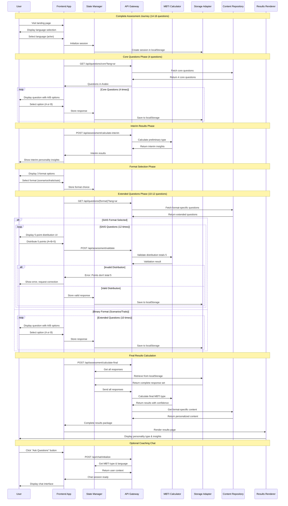
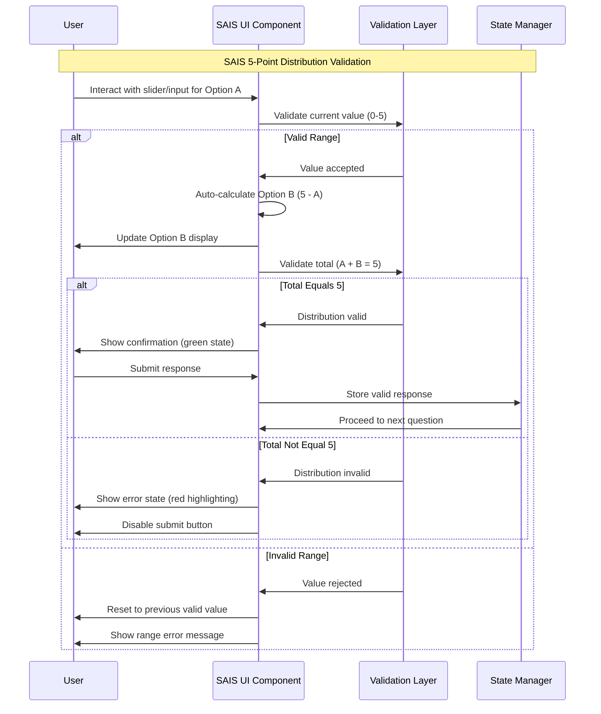

# 8. Core Workflows

The following sequence diagrams illustrate key system workflows showing component interactions, external API integration, and error handling paths for critical user journeys.

### Complete Assessment Flow - End-to-End Journey

### SAIS 5-Point Distribution Validation Workflow


