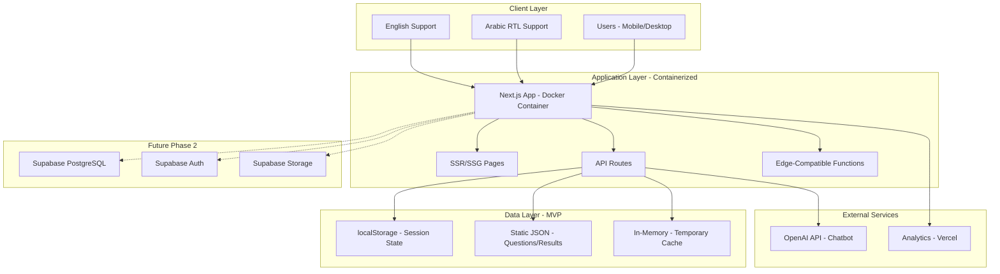

# 2. High Level Architecture

### Technical Summary

The MBTI Coaching Platform MVP utilizes a **portable Next.js full-stack architecture** with containerization support, enabling deployment flexibility across Vercel, traditional cloud providers, or self-hosted environments. The system operates without a database in MVP phase, using localStorage for session persistence and static JSON files for content delivery.

**Key Architectural Decisions:**
- **Portable Design:** Docker containerization for platform independence
- **MVP Data Strategy:** localStorage + static files (no database dependency)  
- **Phased Approach:** Ready for Supabase integration in Phase 2
- **Edge-First:** Optimized for edge computing and global performance
- **Bilingual Core:** Native Arabic/English support with RTL layouts

### System Architecture Diagram


