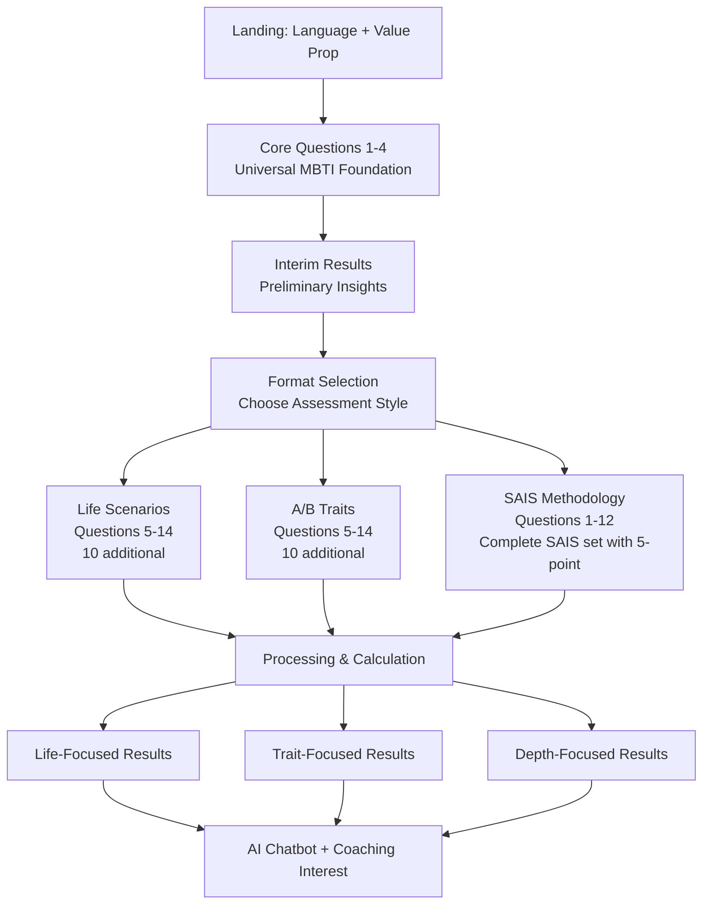

# MBTI Application UI/UX Specification

This document defines the user experience goals, information architecture, user flows, and visual design specifications for the MBTI Application's user interface. It serves as the foundation for visual design and frontend development, ensuring a cohesive and user-centered experience.

## Overall UX Goals & Principles

### Target User Personas

**Power Explorer:** Users seeking deep personality insights through SAIS methodology - psychologically-minded individuals who value consciousness-based self-discovery and inner awareness development.

**Practical Decision-Maker:** Users preferring Life Choice Scenarios - professionals and individuals who want personality insights applicable to real-world situations, relationships, and daily decisions.

**Efficiency-Focused Professional:** Users choosing A/B Personality Traits - career-oriented individuals who prefer direct, efficient assessment methods to understand professional tendencies and communication patterns.

**Arabic-Speaking Users:** Native Arabic speakers across all personas who require culturally appropriate content with RTL layout and consciousness-based terminology in Arabic.

### Usability Goals

- **Rapid Engagement:** 85%+ completion rate with under 10-minute total assessment time
- **Cultural Accessibility:** Seamless Arabic/English language switching without progress loss  
- **Progressive Value:** Interim results after 4 questions provide immediate validation before format selection
- **Personalized Experience:** Format-specific results (life-focused, trait-focused, depth-focused) match user's chosen methodology
- **Mobile Optimization:** 60%+ mobile traffic handled with touch-friendly 5-point distribution interface for SAIS

### Design Principles

1. **Progressive Discovery Over Information Overload** - Present one question at a time with interim validation, avoiding cognitive overwhelm while building engagement
2. **Format-Driven Personalization** - Adapt both questions and results to match user's preferred assessment style (scenarios vs. traits vs. consciousness)
3. **Cultural Authenticity with Technical Precision** - Provide genuine Arabic RTL experience with consciousness-based terminology, while ensuring MBTI type codes (ENFP, ISTJ, etc.) always display LTR for universal recognition
4. **Anticipation Through Transition** - Use dramatic processing screens and reveal experiences to build excitement for personalized results
5. **Actionable Insights First** - Present practical applications before personality theory, ensuring immediate user value

### Change Log
| Date | Version | Description | Author |
|------|---------|-------------|---------|
| 2025-01-26 | 1.0 | Initial UI/UX specification creation | Sally (UX Expert) |

## Information Architecture (IA)

### Site Map / Screen Inventory

```mermaid
graph TD
    A[Landing Page<br/>Language Selection] --> B[Core Assessment<br/>Questions 1-4]
    B --> C[Interim Results<br/>Preliminary Insights]
    C --> D[Format Selection<br/>3 Methodologies]
    D --> E1[Life Scenarios<br/>Questions 5-14]
    D --> E2[A/B Traits<br/>Questions 5-14]
    D --> E3[SAIS Methodology<br/>Questions 1-12 (own set)]
    E1 --> F[Processing Screen<br/>Calculation]
    E2 --> F
    E3 --> F
    F --> G1[Life-Focused Results]
    F --> G2[Trait-Focused Results]
    F --> G3[Depth-Focused Results]
    G1 --> H[AI Chatbot Interface]
    G2 --> H
    G3 --> H
    H --> I[Coaching Interest Capture]
    I --> J[Share Results]
```

### Navigation Structure

**Primary Navigation:** Linear assessment flow with format-specific branching - no traditional menu needed during assessment to maintain focus and prevent abandonment.

**Secondary Navigation:** Language toggle (Arabic/English) persistent throughout experience, progress indicator showing completion status, emergency "restart" option in footer.

**Breadcrumb Strategy:** Progress-based breadcrumbs showing assessment phase (Core Questions → Format Selection → Extended Assessment → Results) with MBTI codes always LTR in Arabic layouts.

## User Flows

### Primary Assessment Flow - Universal Path

**User Goal:** Complete personalized MBTI assessment with format choice  
**Entry Points:** Landing page with language selection  
**Success Criteria:** Receive format-specific results and optional coaching connection

#### Flow Diagram



#### Edge Cases & Error Handling:
- **Language switching mid-assessment:** Preserve all progress and question position
- **SAIS format transition:** Switch to complete SAIS 12-question set with 5-point distribution, different question pool
- **5-point distribution validation:** Prevent proceeding until exactly 5 points allocated
- **Session timeout:** Auto-save every response, offer recovery on return
- **MBTI code display:** Always LTR formatting even in Arabic RTL layout
- **Network failures:** Local storage backup with sync retry mechanisms

#### Future Expansion Architecture:
- **Modular question pools:** Support N questions per format with configurable lengths
- **Dynamic format addition:** Plugin architecture for new assessment methodologies  
- **Adaptive questioning:** Skip redundant dimensions based on confidence scores
- **Multi-language formats:** Cultural adaptation beyond translation for new markets

**Notes:** SAIS methodology uses its own complete 12-question set with specialized 5-point distribution interface. Life/A/B formats follow 4+10 pattern, while SAIS uses a distinct 12-question approach for psychological depth.

## Wireframes & Mockups

**Primary Design Files:** To be determined - recommend Figma for collaborative design and developer handoff with RTL layout support

### Key Screen Layouts

#### SAIS 5-Point Distribution Interface
**Purpose:** Enable precise personality preference measurement through point allocation system

**Key Elements:**
- Question text with consciousness-based terminology (Arabic/English)
- Two option cards (A and B) with clear visual distinction
- 5-point allocation interface (recommended: tap-to-allocate buttons with visual counters)
- Real-time validation showing remaining points
- Progress indicator showing current question position
- Language toggle maintaining assessment state

**Interaction Notes:** Haptic feedback on mobile for point allocation, disabled proceed button until exactly 5 points distributed, smooth animations for point movement

**Design File Reference:** [SAIS Distribution Interface - Mobile & Desktop variants with RTL]

#### Format Selection Screen
**Purpose:** Present three assessment pathways with clear differentiation and expectations

**Key Elements:**
- Three format cards: Life Scenarios (10 more questions), A/B Traits (10 more questions), SAIS Methodology (12 total questions with 5-point)
- Preview of question style for each format
- Expected result type explanation (life-focused, trait-focused, depth-focused)
- Time commitment indication per format
- Consistent "continue" experience across all three formats

**Interaction Notes:** Single selection required, clear visual feedback on selection, cannot change once confirmed to maintain assessment integrity

**Design File Reference:** [Format Selection - Three-card layout with preview content]

#### Arabic RTL Results Display
**Purpose:** Present personality insights with proper RTL layout while maintaining MBTI code clarity

**Key Elements:**
- MBTI personality code in isolated LTR container (e.g., ENFP)
- RTL text flow for Arabic insights and descriptions
- Right-aligned progress through results sections
- Culturally appropriate visual elements and color schemes
- AI chatbot interface with RTL message alignment

**Interaction Notes:** MBTI codes always display left-to-right regardless of language, smooth RTL animations, right-thumb optimized mobile interactions

**Design File Reference:** [Arabic Results Layout - RTL with LTR code containers]

## Component Library / Design System

**Design System Approach:** Custom component library built on Tailwind CSS with Headless UI foundations, specifically designed for bilingual RTL/LTR assessment interfaces with specialized 5-point distribution components.

### Core Components

#### PointDistribution
**Purpose:** Handle SAIS methodology 5-point allocation with validation and visual feedback

**Variants:** 
- Mobile: Tap-to-allocate buttons with haptic feedback
- Desktop: Enhanced layout with larger interaction areas
- RTL: Right-aligned point counters with standard numerals (1,2,3,4,5)

**States:** Empty (0 points allocated), Partial (1-4 points), Complete (5 points), Error (invalid distribution)

**Usage Guidelines:** Always validate total equals 5, provide real-time feedback, disable navigation until complete allocation

#### ProgressIndicator  
**Purpose:** Show assessment progress across variable question counts and formats

**Variants:**
- Linear: Traditional progress bar with standard numerals
- Segmented: Phase-based progress (Core → Format Selection → Extended → Results)
- Format-specific: Variable totals (Life: 14, A/B: 14, SAIS: 12 total with own question set)

**States:** Current question, completed sections, upcoming phases

**Usage Guidelines:** Always show current position and total using standard numerals, adapt to selected format, maintain RTL alignment for Arabic text

#### LanguageToggle
**Purpose:** Seamless Arabic/English switching without assessment interruption

**Variants:** Compact header toggle, expanded selection modal

**States:** English active, Arabic active, switching (loading state)

**Usage Guidelines:** Preserve all assessment state during language changes, ensure MBTI codes remain LTR

#### ResultsCard
**Purpose:** Present format-specific personality insights with psychological terminology

**Variants:**
- Life-focused: Scenario-based insights with practical applications
- Trait-focused: Professional characteristics and cognitive patterns  
- Depth-focused: Consciousness-based insights with psychological depth terminology
- RTL: Arabic layout with isolated MBTI code containers

**States:** Loading, revealed (with animations), expanded detail view

**Usage Guidelines:** Always display MBTI codes in LTR, use evidence-based psychological language for depth insights, maintain cultural authenticity

#### FormatSelector
**Purpose:** Present three assessment pathways with clear differentiation

**Variants:** Card-based selection, modal overlay for mobile

**States:** Unselected, hover preview, selected and locked, processing choice

**Usage Guidelines:** Single selection only, prevent changes after confirmation, show question count and time commitment clearly

## Branding & Style Guide

### Visual Identity
**Brand Guidelines:** Modern, trustworthy design conveying psychological expertise while remaining approachable across Arabic and Western cultural contexts.

### Color Palette
| Color Type | Hex Code | Usage |
|------------|----------|--------|
| Primary | #2563eb | Primary actions, MBTI type highlights, progress indicators |
| Secondary | #0f172a | Headers, body text, professional emphasis |
| Accent | #8b5cf6 | Interactive elements, format selection highlights |
| Success | #059669 | Positive feedback, completion states, validation |
| Warning | #d97706 | Important notices, attention-required states |
| Error | #dc2626 | Errors, validation failures, destructive actions |
| Neutral | #64748b, #f1f5f9, #ffffff | Text hierarchy, borders, backgrounds |

### Typography

#### Font Families
- **Primary:** Inter (Latin), IBM Plex Sans Arabic (Arabic text)
- **Secondary:** System fonts as fallbacks (SF Pro, Segoe UI)
- **Monospace:** JetBrains Mono (for MBTI codes - always LTR)

#### Type Scale
| Element | Size | Weight | Line Height |
|---------|------|--------|-------------|
| H1 | 2.25rem (36px) | 700 | 1.2 |
| H2 | 1.875rem (30px) | 600 | 1.3 |
| H3 | 1.5rem (24px) | 600 | 1.4 |
| Body | 1rem (16px) | 400 | 1.6 |
| Small | 0.875rem (14px) | 400 | 1.5 |

### Iconography
**Icon Library:** Heroicons for UI elements with RTL-appropriate directional variants

**Usage Guidelines:** Minimal, purposeful icons that work across cultures, avoid directional bias, ensure accessibility with proper labels

### Spacing & Layout
**Grid System:** 12-column responsive grid with RTL support

**Spacing Scale:** 4px base unit system (4, 8, 16, 24, 32, 48, 64, 96px) for consistent rhythm across languages

## Accessibility Requirements

**Compliance Target:** WCAG 2.1 AA standards ensuring broad accessibility across Arabic and English interfaces

### Key Requirements

**Visual:**
- Color contrast ratios: 4.5:1 for normal text, 3:1 for large text, works with both Arabic and Latin scripts
- Focus indicators: 2px solid outline with high contrast, visible in RTL layouts  
- Text sizing: Minimum 16px base size, scalable to 200% without horizontal scrolling

**Interaction:**
- Keyboard navigation: Full tab order support for RTL and LTR layouts, logical sequence
- Screen reader support: ARIA labels in both languages, proper heading structure, MBTI codes announced as intended
- Touch targets: Minimum 44px for mobile interactions, especially critical for 5-point distribution interface

**Content:**
- Alternative text: Descriptive text for all images, cultural context for Arabic users
- Heading structure: Logical H1-H6 hierarchy maintaining meaning in both languages
- Form labels: Clear association between labels and inputs, error messaging in user's selected language

### Testing Strategy
Automated accessibility testing with axe-core, manual testing with screen readers (NVDA, VoiceOver), RTL layout validation, and cultural accessibility review for Arabic content appropriateness.

## Responsiveness Strategy

### Breakpoints
| Breakpoint | Min Width | Max Width | Target Devices |
|------------|-----------|-----------|----------------|
| Mobile | 320px | 767px | Smartphones, priority for 60%+ traffic |
| Tablet | 768px | 1023px | iPads, Android tablets, RTL layout testing |
| Desktop | 1024px | 1439px | Laptops, smaller desktops |
| Wide | 1440px | - | Large monitors, enhanced layouts |

### Adaptation Patterns

**Layout Changes:** Single-column mobile prioritizing 5-point distribution clarity, two-column desktop for SAIS questions, RTL-appropriate content flow

**Navigation Changes:** Collapsed mobile navigation, expanded desktop format selection, RTL gesture support

**Content Priority:** Question text first on mobile, progress indicators always visible, MBTI codes prominently displayed

**Interaction Changes:** Touch-optimized point allocation on mobile, enhanced hover states on desktop, RTL swipe patterns

## Animation & Micro-interactions

**Motion Principles:** Subtle, purposeful animations that enhance assessment flow without distraction, culturally neutral transitions, RTL-appropriate directional animations

### Key Animations
- **Question Transitions:** Slide animations respecting RTL/LTR reading direction (Duration: 300ms, Easing: ease-out)
- **Point Allocation Feedback:** Haptic and visual confirmation for 5-point distribution (Duration: 150ms, Easing: ease-in-out)
- **Progress Updates:** Smooth progress bar animations maintaining engagement (Duration: 400ms, Easing: ease-in-out)
- **Results Reveal:** Dramatic type discovery with anticipation building (Duration: 2000ms, Easing: ease-in-out)
- **Format Selection:** Card highlight and selection confirmation (Duration: 200ms, Easing: ease-out)

## Performance Considerations

### Performance Goals
- **Page Load:** <2 seconds for initial assessment start
- **Interaction Response:** <100ms for 5-point distribution feedback  
- **Animation FPS:** 60fps for all transitions, optimized for mobile

### Design Strategies
Minimize heavy imagery, optimize font loading for Arabic/Latin scripts, lazy load non-critical components, cache MBTI calculation results

## Next Steps

### Immediate Actions
1. **Stakeholder Review:** Validate UX goals, component requirements, and Arabic cultural adaptations
2. **Design Tool Setup:** Configure Figma workspace with RTL support and component library foundation
3. **Technical Handoff:** Prepare specifications for 5-point distribution interface and variable question architecture
4. **Content Review:** Finalize psychological terminology for depth-focused results, ensure cultural appropriateness

### Design Handoff Checklist
- [x] All user flows documented with three format variations
- [x] Component inventory complete with RTL/LTR variants
- [x] Accessibility requirements defined for bilingual interface
- [x] Responsive strategy clear with mobile-first approach
- [x] Brand guidelines incorporated with psychological positioning
- [x] Performance goals established for assessment flow